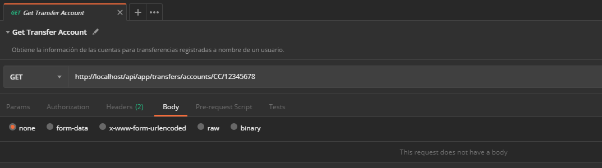
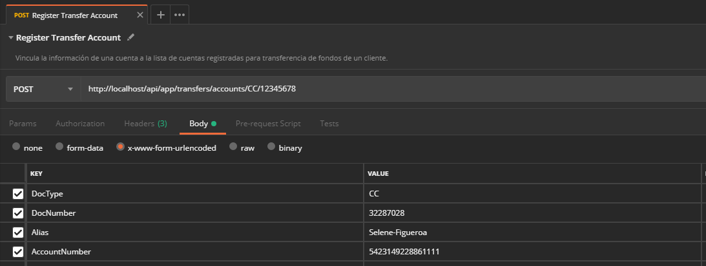
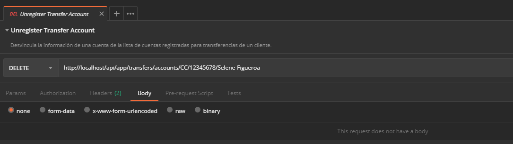

# Administrar cuentas para transferencias de un cliente

Expone las operaciones que facilitan la administración de las cuentas para transferencia de fondos de un cliente.

## Consultar cuentas registradas de un cliente

Obtiene la información de las cuentas vinculadas a un cliente para realizar transferencia de fondos.

Verbo | Endpoint | Requiere autenticación
:---: | -------- | :------------:
GET | http://localhost/api/app/transfers/accounts/docType/{DocType}/docNumber/{DocNumber} | [x]

**[Segmentos de URL]**: La información entre corchetes en la URL se denomina segmentos de URL y aplican solo para algunas operaciones. Cuando aparezcan, deben ser reemplazados por sus valores correspondientes omitiendo los corchetes. Usando como ejemplo la siguiente URL: `http://localhost/api/operation/value/{value}`, se establecerá el valor: `abc` en el segmento: `{value}` y la URL final sería: `http://localhost/api/operation/value/abc`

### Valores de la solicitud

Campo | Tipo de dato | Descripción | Requerido
:---: | :----------: | ----------- | :-------:
{DocType} | `string` | Tipo de documento del cliente que tiene vinculada(s) la(s) cuenta(s). Cualquier valor de la columna **Acrónimo** en el dominio de los **[Tipos de documento](Admin-CustomerTransferAccounts.md#docTypes)**. Valor esperado en la URL sin corchetes. | [x]
{DocNumber} | `string` | Número de documento del cliente que tiene vinculadas las cuentas. Valor esperado en la URL sin corchetes. | [x]

#### Ejemplo en Postman

Consultar la(s) cuenta(s) registradas del cliente identificado con el tipo de documento `CC` (Cedula de ciudadanía), número `12345678`


#### Ejemplo en curl

```curl
curl -X GET \
  http://localhost/api/app/transfers/accounts/docType/CC/docNumber/12345678 \
  -H "X-PRO-Auth-App: 1ea2e59d-0e04-4e53-883c-d8387e23443e" \
  -H "X-PRO-Auth-Payload: eyJ0eXAiOiJKV1QiLCJhbGciOiJIUzI1NiJ9.eyJOb25jZSI6ImQxZGE4ZjM4LTY3MWUtNDY1..."
```

### Datos de la respuesta

```json
[
  {
    "alias": "Paloma Veliz",
    "cardHolderName": "Paloma Veliz Chávez",
    "maskedPan": "************6526",
    "cardHolderDocType": "CC",
    "cardHolderDocNumber": "000000000"
  },
  {
    "alias": "Doris Dueñas",
    "cardHolderName": "Doris Dueñas Urena",
    "maskedPan": "************5678",
    "cardHolderDocType": "CC",
    "cardHolderDocNumber": "000000000"
  },
  {
    "alias": "Michelle Carrillo",
    "cardHolderName": "Michelle Carrillo Puente",
    "maskedPan": "************9101",
    "cardHolderDocType": "CC",
    "cardHolderDocNumber": "000000000"
  }
]
```

### Descripción de la respuesta

Campo | Tipo de dato | Descripción
:---: | :----------: | -----------
Alias | `string` | Nombre que identifica a la cuenta.
CardHolderName | `string` | Nombre del tarjetahabiente o titular de la cuenta.
MaskedPan | `string` | Número enmascarado de la cuenta.
CardHolderDocType | `string` | Tipo del documento del titular de la cuenta.
CardHolderDocNumber | `string` |Número del documento del titular de la cuenta.


### Valores de respuesta comunes

HttpStatus | Tipo | Descripción
:--------: | :--: | -----------
200 | int | La solicitud finalizó satisfactoriamente.
204 | int | La solicitud finalizó satisfactoriamente pero no hay contenido adicional en la respuesta.

## Registrar una cuenta para transferencias

Vincula la información de una cuenta a la lista de cuentas registradas para transferencia de fondos de un cliente.

Verbo | Endpoint | Requiere autenticación
:---: | -------- | :------------:
POST | http://localhost/api/app/transfers/accounts/docType/{DocType}/docNumber/{DocNumber} | [x]

Campo | Tipo de dato | Descripción | Requerido
:---: | :----------: | ----------- | :-------:
{DocType} | `string` | Tipo de documento del cliente a quien se le vincula la cuenta. Cualquier valor de la columna **Acrónimo** en el dominio de los **[Tipos de documento](Admin-CustomerTransferAccounts.md#docTypes)**. Valor esperado en la URL sin corchetes. | [ Si ]
{DocNumber} | `string` | Número de documento del cliente a quien se le vincula la cuenta. Valor esperado en la URL sin corchetes. | [ Si ]
DocType | `string` | Tipo de documento del titular de la cuenta que se está vinculando. Cualquier valor de la columna **Acrónimo** en el dominio de los **[Tipos de documento](Admin-CustomerTransferAccounts.md#docTypes)**. | [ Si ]
DocNumber | `string` | Número de documento del titular de la cuenta que se está vinculando. | [ Si ]
Alias | `string` | Nombre con el que se identificará a la cuenta. Si no se proporciona se establece como alias la combinación del tipo y número de documento del titular de la cuenta, por ejemplo, CC-00000000 | [ No ]
AccountNumber | `string` | Número de la cuenta. Si no se proporciona un número de cuenta, el sistema busca el primer número de cuenta asociado con el tipo y número de identificación y lo establece como valor predeterminado.   | [ No ]

#### Ejemplo en Postman

Registrar la cuenta `5423149228861111` del titular identificado con el tipo de documento `CC` (Cedula de ciudadanía), número `32287028` utilizando el nombre `Selene-Figueroa` y asociar esta información con el cliente identificado con el tipo de documento `CC` (Cedula de ciudadanía), número `12345678`



#### Ejemplo en curl

```curl
curl -X POST http://localhost/api/app/transfers/accounts/docType/CC/docNumber/12345678 \
  -H "Content-Type: application/x-www-form-urlencoded" \
  -H "X-PRO-Auth-App: 1ea2e59d-0e04-4e53-883c-d8387e23443e" \
  -H "X-PRO-Auth-Payload: eyJ0eXAiOiJKV1QiLCJhbGciOiJIUzI1NiJ9.eyJOb25jZSI6ImJjZTE5M2VlLTY0Y2QtNDhjMC05NzY..." \
  -d "DocType=CC&DocNumber=32287028&Alias=Selene-Figueroa&AccountNumber=5423149228861111"
```

### Valores de respuesta más utilizados

HttpStatus | Tipo de dato | Descripción
:--------: | :----------: | -----------
200 | `int` | La solicitud finalizó satisfactoriamente.
406 | `int` | Alguno de los valores proporcionados es invalido. El campo `ReasonPhrase` contiene un mensaje que describe el problema encontrado.
409 | `int` | No se encuentra información de la cuenta para vincular con los datos suministrados. El campo `ReasonPhrase` contiene un mensaje que describe el problema encontrado.

## Eliminar una cuenta registrada

Desvincula la información de una cuenta de la lista de cuentas registradas para transferencias de un cliente.

Verbo | Endpoint | Requiere autenticación
:---: | -------- | :------------:
DELETE | http://localhost/api/app/transfers/accounts/docType/{DocType}/docNumber/{DocNumber}/alias/{Alias} | [x]

### Valores de la solicitud

Campo | Tipo de dato | Descripción | Requerido
:---: | :----------: | ----------- | :-------:
{DocType} | `string` | Tipo de documento del cliente que tiene vinculada la cuenta. Cualquier valor de la columna **Acrónimo** en el dominio de los **[Tipos de documento](Admin-CustomerTransferAccounts.md#docTypes)**. Valor esperado en la URL sin corchetes. | [ Si ]
{DocNumber} | `string` | Tipo de documento del cliente que tiene vinculada la cuenta. Valor esperado en la URL sin corchetes. | [ Si ]
{Alias} | `string` | Nombre con el que se identificó la cuenta en el momento de la vinculación. Valor esperado en la URL sin corchetes. Si no se proporcionó alias en el registro, el sistema combinará el tipo y número de documento del titular de la cuenta, por ejemplo, CC-00000000 | [ No ]

#### Ejemplo en Postman

Eliminar el registro de la cuenta identificada con el nombre `Selene-Figueroa` asociada con el cliente identificado con el tipo de documento `CC` (Cedula de ciudadanía) y el número `12345678`



#### Ejemplo en curl

```curl
curl -X DELETE \
  http://localhost/api/app/transfers/accounts/docType/CC/docNumber/12345678/alias/Selene-Figueroa \
  -H "X-PRO-Auth-App: 1ea2e59d-0e04-4e53-883c-d8387e23443e" \
  -H "X-PRO-Auth-Payload: eyJ0eXAiOiJKV1QiLCJhbGciOiJIUzI1NiJ9.eyJOb25jZSI6ImM0Y2JiMWU2LWE0MGMtNGJkNi04MGFj..."
```

## Eliminar una cuenta registrada sin alias

A partir de la versión 2019.09.13.00 se permite la desvinculación de la información de una cuenta de la lista de cuentas registradas para transferencias de un cliente, sin la utilización de un alias de registro.

| Verbo  | Endpoint                                                     | Requiere autenticación |
| :----: | ------------------------------------------------------------ | :--------------------: |
| DELETE | http://localhost/api/app/transfers/accounts/docTypeOwner/{docTypeOwner}/docNumberOwner/{docNumberOwner}/docTypeLink/{docTypeLink}/docNumberLink/{docNumberLink} |          [x]           |

### Valores de la solicitud

|      Campo       | Tipo de dato | Descripción                                                  | Requerido |
| :--------------: | :----------: | ------------------------------------------------------------ | :-------: |
|  {docTypeOwner}  |   `string`   | Tipo de documento del cliente que tiene vinculada la cuenta. Cualquier valor de la columna **Acrónimo** en el dominio de los **[Tipos de documento](Admin-CustomerTransferAccounts.md#docTypes)**. Valor esperado en la URL sin corchetes. |  [ Si ]   |
| {docNumberOwner} |   `string`   | Número de documento del cliente que tiene vinculada la cuenta. Valor esperado en la URL sin corchetes. |  [ Si ]   |
|  {docTypeLink}   |   `string`   | Tipo de documento del titular de la cuenta vinculada. Cualquier valor de la columna **Acrónimo** en el dominio de los **[Tipos de documento](Admin-CustomerTransferAccounts.md#docTypes)**. Valor esperado en la URL sin corchetes. |  [ Si ]   |
| {docNumberLink}  |   `string`   | Número de documento del titular de la cuenta vinculada.      |  [ Si ]   |

### Valores de respuesta más utilizados

HttpStatus | Tipo de dato | Descripción
:--------: | :----------: | -----------
200 | `int` | La solicitud finalizó satisfactoriamente.
404 | `int` | No se encontró la cuenta registrada con los valores suministrados. El campo `ReasonPhrase` contiene un mensaje que describe el problema encontrado.
406 | `int` | Alguno de los valores proporcionados es invalido. El campo `ReasonPhrase` contiene un mensaje que describe el problema encontrado.

## Anexos

### Tipos de documento

<div id="docTypes"></div>

Acrónimo | Descripción
:------: | -----------
CC | Cédula de Ciudadanía
NIT | Número de Identificación Tributaria
TI | Tarjeta de Identidad
CE | Cédula de Extranjería
PAS | Pasaporte

## Información relacionada

- [Solicitar un token de autenticación](JWT-Request.md)
- [Mensajes de respuesta en Aspen](Responses.md)
