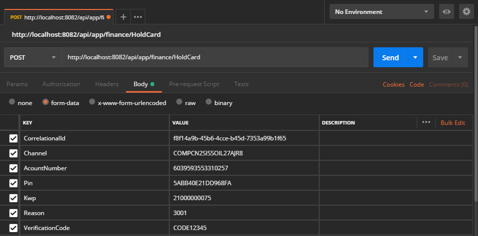

# Bloqueo de una tarjeta

Procesa una solicitud para realizar el bloqueo de la tarjeta de un cliente.

| Verbo | Endpoint                                      | Requiere autenticación |
| :---: | --------------------------------------------- | :--------------------: |
| POST  | http://localhost/api/app/ext/tup/cards/lock   |          [ Si ]        |

[^Segmentos de URL]: La información entre corchetes en la URL se denomina segmentos de URL y aplican solo para algunas operaciones. Cuando aparezcan en un ejemplo, deben ser reemplazados por sus valores correspondientes omitiendo los corchetes. Por ejemplo, sin en la URL de ejemplo apareciera http://localhost/api/operation/value/{value}, para establecer el valor de  `value` en la solicitud a la cadena `abc`, la URL final se vería de la siguiente forma: http://localhost/api/operation/value/abc 

## Datos de la solicitud (body)

```json
{
  "CorrelationalId": "g6t14a9b-42b1-4dde-a45d-4568a99b1f65",
  "AccountNumber": "6039593553310257",
  "Pin": "5ABB40E21DD968FA",
  "Kwp": "B21000000075",
  "Reason": 3001,
  "VerificationCode" : "CODE12345"
}
```

### Valores de la solicitud

Campo | Tipo de dato| Descripción | Requerido
:---: | :--------:| ------------ | :-----:
CorrelationalId | guid |Identificador de la transacción, debe ser único por cada solicitud enviada.| [Si]
AccountNumber | string | Número de la tarjeta que se envía en la solicitud para ser bloqueada. | [ Si ]
Pin | string | Clave de la tarjeta que se asigna en el proceso de activación. Se debe enviar el pinblock como una cadena hexadecimal de longitud 16, ejemplo "5ABB40E21DD968FA". Ejemplo generación de [PinBlock](https://github.com/RD-Processa/Pinblock-Helper).| [ Si ]
Kwp | string | Nombre de la llave KWP con la cual fue generado el pinblock, se debe enviar en este campo el nombre asociado a la llave KWP sin el prefijo para poder realizar la “traducción del pinblock”. | [ Si ]
Reason | int | [Código](#Códigos-de-bloqueo-de-una-tarjeta) de 4 dígitos que indica la razón por la cual será bloqueada la tarjeta. | [ Si ]
VerificationCode | string | Código de verificación para realizar validaciones en datacrédito relacionadas con el cliente. | [ Si ] 

## Datos de la respuesta

> Si al procesar la respuesta del servicio está utilizando un serializador que distinga mayúsculas y minúsculas, tenga en cuenta que Aspen genera todas sus respuestas utilizando el formato conocido como [LowerCamelCase](https://en.wikipedia.org/wiki/Camel_case)


Campo | Tipo de dato | Descripción | 
:---: | :--------: | ------------ |
CorrelationalId | guid |Identificador único de la transacción para la que se genera la respuesta.| 
ResponseCode | int| Código de estado de http de acuerdo con la especificación [RFC 2616](https://www.w3.org/Protocols/rfc2616/rfc2616-sec10.html) que representa el resultado de la transacción. En general un código en el rango 200 indica que la operación terminó satisfactoriamente.
ResponseMessage | string | Describe el mensaje asociado al ReponseCode devuelto en la respuesta de la transacción.
Successful | bool | Cuando el valor es true indica que la ejecución de la operación terminó de forma satisfactoria, de lo contrario el valor será false.
Empty | bool | Para uso interno. No es necesario procesar esta información.
MachineName | string | Para uso interno. No es necesario procesar esta información.
AuthorizationNumber | string | Número de autorización emitido para la operación o ceros (000000) si la operación no se pudo completar.
Date | datetime | Fecha y hora en la cual se procesó la operación.

### Valores de respuesta más utilizados

HttpStatus | Tipo | Descripción
:---: | :--------: | ------------
200 | int | Transacción exitosa. La transacción de bloqueo de tarjeta se realizó satisfactoriamente. 
404 | int | No se encontró una tarjeta asociada al cliente para ser bloqueada.

## Códigos de bloqueo de una tarjeta
Código | Razón de bloqueo
:----: | :---------------: |
3000 | Tarjeta pérdida |
3001 | Tarjeta robada |
3002 | Tarjeta no entregada |
3003 | Tarjeta falsificada |
3700 | Olvido de pin |

## Ejemplo en Postman


