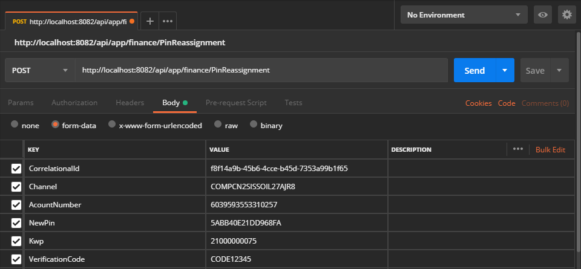

# Cambio de clave de una tarjeta

Procesa una solicitud para realizar el cambio de clave de la tarjeta de un cliente.

| Verbo | Endpoint                                      | Requiere autenticación |
| :---: | --------------------------------------------- | :--------------------: |
| POST  | http://localhost/api/app/finance/PinChange |          [ Si ]        |

[^Segmentos de URL]: La información entre corchetes en la URL se denomina segmentos de URL y aplican solo para algunas operaciones. Cuando aparezcan en un ejemplo, deben ser reemplazados por sus valores correspondientes omitiendo los corchetes. Por ejemplo, sin en la URL de ejemplo apareciera http://localhost/api/operation/value/{value}, para establecer el valor de  `value` en la solicitud a la cadena `abc`, la URL final se vería de la siguiente forma: http://localhost/api/operation/value/abc 

## Datos de la solicitud (body)

```json
{
  "CorrelationalId": "f8f14a9b-45b6-4cce-b45d-7353a99b1f65",
  "Channel": "COMPCN2SISSOIL27AJR8",
  "AcountNumber": "6039593553310257",
  "OldPin": "5ABB40E21DD968FA",
  "NewPin": "5B4BB2AE1E485785",
  "Kwp": "21000000075",
  "VerificationCode" : "CODE12345"
}
```

### Valores de la solicitud

Campo | Tipo de dato| Descripción | Requerido
:---: | :--------:| ------------ | :-----:
CorrelationalId | guid | Identificador de la petición, debe ser único por cada solicitud (request) que se realice. | [ Si ]
Channel | string | Identificador del canal para un cliente. Este valor será entregado al cliente. | [ Si ]
AccountNumber | string | Número de la tarjeta que se envía en la solicitud para ser bloqueada. | [ Si ]
OldPin | string | Clave actual de la tarjeta que envía el cliente en la operación para ser cambiada. Este puede ser el pin con longitud de 4 dígitos o el pinblock como una cadena hexadecimal de longitud 16. | [ Si ]
NewPin | string | Clave nueva de la tarjeta que envía el cliente para ser asignada a la tarjeta. Este puede ser el pin con longitud de 4 dígitos o el pinblock como una cadena hexadecimal de longitud 16. | [ Si ]
Kwp | string | Si se envía el pinblock en el pin de la tarjeta, es obligatorio enviar la Llave KWP con el nombre de la llave asociada, para realizar la “traducción de pin”. | [ Si ]
VerificationCode | string | Código de verificación para realizar validaciones relacionadas con el cliente. | [Si] 

## Datos de la respuesta

> Si al procesar la respuesta del servicio está utilizando un serializador que distinga mayúsculas y minúsculas, tenga en cuenta que Aspen genera todas sus respuestas utilizando el formato conocido como [LowerCamelCase](https://en.wikipedia.org/wiki/Camel_case)


Campo | Tipo de dato | Descripción | 
:---: | :--------: | ------------ |
CorrelationalId | guid |Identificador único de la transacción para la que se genera la respuesta.| 
ResponseCode | int| Código de estado de http de acuerdo con la especificación [RFC 2616](https://www.w3.org/Protocols/rfc2616/rfc2616-sec10.html) que representa el resultado de la transacción. En general un código en el rango 200 indica que la operación terminó satisfactoriamente.
ResponseMessage | string | Describe el mensaje asociado al ReponseCode devuelto en la respuesta de la transacción.
Sucessful | bool | Cuando el valor es true indica que la ejecución de la operación terminó de forma satisfactoria, de lo contrario el valor será false.
Empty | bool | Para uso interno. No es necesario procesar esta información.
MachineName | string | Para uso interno. No es necesario procesar esta información.
AuthorizationNumber | string | Número de autorización emitido para la operación o ceros (000000) si la operación no se pudo completar.
Date | datetime | Fecha y hora en la cual se procesó la operación.

### Valores de respuesta más utilizados

HttpStatus | Tipo | Descripción
:---: | :--------: | ------------
200 | int | Transacción exitosa. La transacción de cambio de clave de la tarjeta se realizó satisfactoriamente. 
404 | int | No se encontró una tarjeta asociada al cliente para realizar el cambio de la clave.

## Ejemplo en Postman




  

