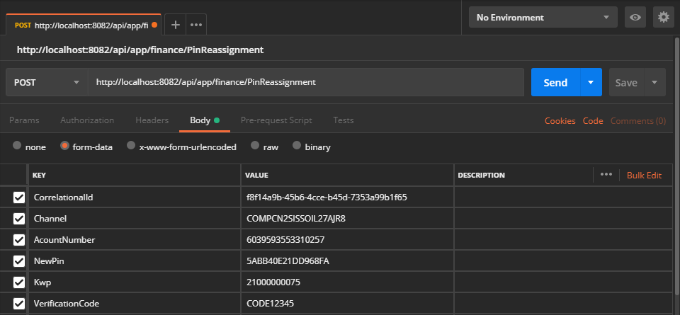

# Restablecer la clave de una tarjeta

Procesa una solicitud para restablecer la clave de la tarjeta de un cliente en caso de olvido o pérdida de la clave actual.

| Verbo | Endpoint                                      | Requiere autenticación |
| :---: | --------------------------------------------- | :--------------------: |
| POST  | http://localhost/api/app/ext/tup/cards/resetpin |          [ Si ]        |

[^Segmentos de URL]: La información entre corchetes en la URL se denomina segmentos de URL y aplican solo para algunas operaciones. Cuando aparezcan en un ejemplo, deben ser reemplazados por sus valores correspondientes omitiendo los corchetes. Por ejemplo, sin en la URL de ejemplo apareciera http://localhost/api/operation/value/{value}, para establecer el valor de  `value` en la solicitud a la cadena `abc`, la URL final se vería de la siguiente forma: http://localhost/api/operation/value/abc 

## Datos de la solicitud (body)

```json
{
  "CorrelationalId": "g6t14a9b-42b1-4dde-a45d-4568a99b1f65",
  "AccountNumber": "6039593553310257",
  "NewPin": "5ABB40E21DD968FA",
  "Kwp": "B21000000075",
  "VerificationCode" : "CODE12345"
}
```

### Valores de la solicitud

Campo | Tipo de dato| Descripción | Requerido
:---: | :--------:| ------------ | :-----:
CorrelationalId | guid | Identificador de la petición, debe ser único por cada solicitud (request) que se realice. | [ Si ]
AccountNumber | string | Número de la tarjeta que se envía en la solicitud para ser bloqueada. | [ Si ]
NewPin | string | Clave nueva de la tarjeta que será asignada en la operación de reasignación de clave. Se debe enviar el pinblock como una cadena hexadecimal de longitud 16, ejemplo "5ABB40E21DD968FA". Ejemplo generación de [PinBlock](https://github.com/RD-Processa/Pinblock-Helper). | [ Si ]
Kwp | string | Nombre de la llave KWP con la cual fue generado el pinblock, se debe enviar en este campo el nombre asociado a la llave KWP sin el prefijo para poder realizar la “traducción del pinblock”. | [ Si ]
VerificationCode | string | Código de verificación para realizar validaciones en datacrédito relacionadas con el cliente. | [Si] 

## Datos de la respuesta

> Si al procesar la respuesta del servicio está utilizando un serializador que distinga mayúsculas y minúsculas, tenga en cuenta que Aspen genera todas sus respuestas utilizando el formato conocido como [LowerCamelCase](https://en.wikipedia.org/wiki/Camel_case)


Campo | Tipo de dato | Descripción | 
:---: | :--------: | ------------ |
CorrelationalId | guid |Identificador único de la transacción para la que se genera la respuesta.| 
ResponseCode | int| Código de estado de http de acuerdo con la especificación [RFC 2616](https://www.w3.org/Protocols/rfc2616/rfc2616-sec10.html) que representa el resultado de la transacción. En general un código en el rango 200 indica que la operación terminó satisfactoriamente.
ResponseMessage | string | Describe el mensaje asociado al ReponseCode devuelto en la respuesta de la transacción.
Successful | bool | Cuando el valor es true indica que la ejecución de la operación terminó de forma satisfactoria, de lo contrario el valor será false.
Empty | bool | Para uso interno. No es necesario procesar esta información.
MachineName | string | Para uso interno. No es necesario procesar esta información.
AuthorizationNumber | string | Número de autorización emitido para la operación o ceros (000000) si la operación no se pudo completar.
Date | datetime | Fecha y hora en la cual se procesó la operación.

### Valores de respuesta más utilizados

HttpStatus | Tipo | Descripción
:---: | :--------: | ------------
200 | int | Transacción exitosa. La transacción de reasignación de clave de la tarjeta se realizó satisfactoriamente. 
404 | int | No se encontró una tarjeta asociada al cliente para realizar la reasignación de la clave.

## Ejemplo en Postman


